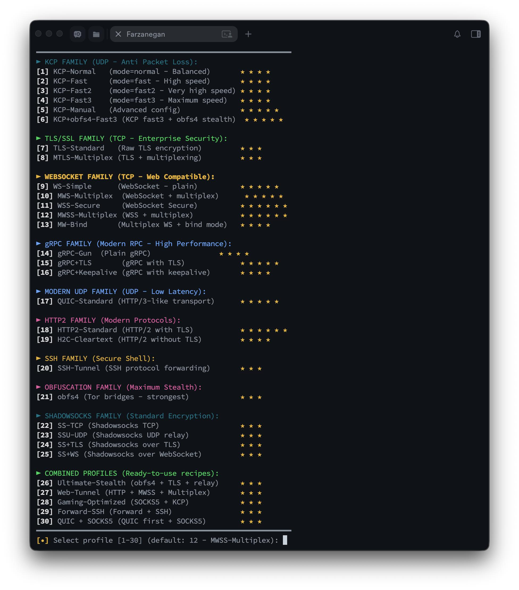

# Speed Tunneling | [📄 فارسی](README.fa.md)
🚀 **Professional script for managing secure and anti-filtering tunnels with GOST**
> Special focus on bypassing DPI, high stability in unstable networks, and support for diverse and combined protocols (Shadowsocks, KCP, obfs4, QUIC, gRPC, WebSocket and more than 30 ready-made combinations).

  
  
  
  

  <b>Strong anti-filtering | Weak networks | Streaming & Gaming</b>

---

## ✨ Key Features
- **Support for more than 40 combined profiles** (KCP, QUIC, gRPC, Shadowsocks, obfs4, TLS, WebSocket, Multiplex, etc.)
- **Beautiful interactive menu** with color coding and easy protocol selection
- **Automatic systemd service creation** + **Restart=always**
- **Smart Watchdog** (via cron) for monitoring and automatic restart
- **Automatic firewall** (UFW / iptables)
- **Live logs** and service management (Start/Stop/Edit/Logs/Delete)
- **Multi-Port Forwarding support** (TCP + UDP simultaneously)
- **Stealth TLS certificate** (Stealth certificate similar to speedtest.net)
- **Optimized for Iranian & foreign VPS** – high stability under packet loss and filtering

---

## ⚡ Supported Protocols and Combinations

| Family                | Main Protocols                                  | Main Use Case                        | Stealth / Speed Level |
|-----------------------|--------------------------------------------------|--------------------------------------|------------------------|
| KCP Family            | Normal / Fast / Fast2 / Fast3 / Manual + obfs4  | Anti packet loss, gaming, download   | ★★★★☆                 |
| TLS/SSL Family        | TLS, mTLS                                        | Enterprise-grade security            | ★★★☆☆                 |
| WebSocket Family      | WS, MWS, WSS, MWSS + Bind                        | Looks like web traffic, easy bypass  | ★★★★★                 |
| gRPC Family           | gRPC, gRPC+TLS, gRPC+Keepalive                   | Strong anti-filtering, high performance | ★★★★★              |
| Modern UDP            | QUIC                                             | Lowest latency, streaming            | ★★★★★                 |
| HTTP/2 Family         | HTTP2, H2C                                       | Looks like real HTTP/2               | ★★★★☆                 |
| Shadowsocks Family    | SS, SSU, SS+TLS, SS+WS + aes-256-gcm             | Standard, fast on modern hardware    | ★★★★☆                 |
| Obfuscation           | obfs4, obfs4+TLS                                 | Maximum stealth                      | ★★★★★★                |
| Combined Recipes      | KCP+TLS, SS+QUIC, gRPC+obfs4 and 20+ more combos | Iran-specific scenarios              | ★★★★★                 |

---

## 📥 Installation

To get the script, please contact us on Telegram:

**[@SpeedwIT](https://t.me/SpeedwIT)** — Support & Download

Or join our channel: [t.me/Speedw_IT](https://t.me/Speedw_IT)

> The script is distributed privately. Contact us to receive it.

## 🖥️ Usage Guide

### Quick Start Guide

#### 1. Foreign Server (Kharej – Server)
1. From the main menu select **[2] Configure Server Tunnel (Kharej)**
2. Choose your **desired protocol** from the list (e.g. KCP-Fast3, SS-TCP, obfs4+TLS, etc.)
3. Enter **Listen port** (server listening port)
   - Default: 8443
   - Recommended: 443, 8443, 2083 or non-standard ports for better bypass
4. Confirm the generated **password** (Y) or enter manually (N)
5. The script will automatically:
   - Generate stealth TLS certificate (if required by protocol)
   - Open firewall (TCP/UDP)
   - Create, enable and start systemd service
   - Show public IP and final password (save it!)

#### 2. Iran Server (Client)
1. From the main menu select **[1] Configure Client Tunnel (Iran)**
2. Choose the **tunnel protocol**
   - **Must be exactly the same as the foreign server** (e.g. if server is KCP-Fast3, choose the same here)
3. Enter foreign server information:
   - Foreign server IP
   - Tunnel port (same as server's Listen port)
   - Password (exactly the same one created on foreign server)
4. Enter **Forward ports** (ports you want to open on Iran side)
   - Example: `80,443,2083` (comma separated)
5. For each port choose protocol:
   - 1 = TCP only
   - 2 = UDP only
   - 3 = Both (TCP + UDP)
   - Script opens firewall according to selected protocol

6. The script will automatically:
   - Create and start client systemd service
   - Enable Watchdog (auto monitor & restart)
   - Show connection details (with protocol per port)

### 3. Tunnel Management
- List / Start / Stop / Restart / Logs / Edit / Delete
- View live logs: `journalctl -u gost-client-... -f`

---

## 📸 Screenshot

  

---

## ⚠️ Need Help?

If you encounter any issues, contact me on Telegram:

**[@SpeedwIT](https://t.me/SpeedwIT)** — Support & Troubleshooting

---

## ⭐ Support the Project

If this script was useful and you want development to continue:

- Give it a **Star**
- **Fork** and modify
- Share in Telegram groups or channels

**Developer Telegram Channel:** [t.me/Speedw_IT](https://t.me/Speedw_IT)  
**Support:** [t.me/SpeedwIT](https://t.me/SpeedwIT)  
**GitHub:** [github.com/SpeedwiT](https://github.com/SpeedwiT)

---

## 💖 Support / Donate

If you're using **Speed Tunneling** and would like to support the development of this project, you can donate via:

💰 Cryptocurrency

 

**Trx (TRC20):** `TWUcNhGugfjTdMiREsWfDbrZR2yq5WLsyR`  

**Usdt (Bep20):** `0xEaE80700A282970C2d7d7993F9F31a2689e37E31`  

> Any contribution, big or small, helps keep the project alive and motivates further development. 🙏

---

## 📄 License
This project is released under a **custom restrictive license** (All Rights Reserved).  
You may NOT redistribute, modify, or use commercially without explicit written permission from SpeedwiT.  
See [LICENSE](LICENSE) for details.
